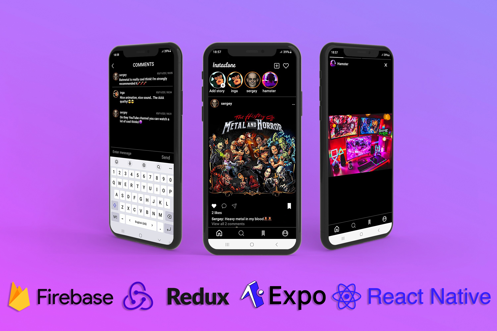

<!-- PROJECT LOGO -->
 

  

  <h3 align="center">Instagram Clone</h3>

  

    A Instagram clone app made with React Native/Expo CLI and Firebase
  

   
  

<!-- ABOUT THE PROJECT -->

## ℹ️ About The Project

Introducing my pet project, an Instagram clone powered by React Native, Redux, Firebase, and Expo CLI. This app is a personal project that I am pursuing out of my passion for mobile app development and social media.

The app is built using React Native, which allows for the creation of high-performance native mobile apps for both iOS and Android. The state management of the app is handled using Redux, which makes it easy to manage the application state and keep the codebase scalable and maintainable.

The backend of the app is powered by Firebase, a comprehensive backend platform that provides a range of services for mobile and web apps. Firebase provides features such as authentication, real-time database, storage, all of which are essential for the functioning of a social media app.

Finally, Expo CLI is used to build, test, and deploy the app. Expo CLI is a toolchain built around React Native, which makes it easy to develop, test, and deploy apps for iOS and Android with just one codebase. To test the app, I have used Android devices as I haven't tested it on iOS yet.

Overall, this pet project is an opportunity for me to sharpen my skills in mobile app development while creating a clone of one of the most popular social media platforms in the world.

## 🆕 Getting Started

- ### **Prerequisites**

- [React Native](https://reactnative.dev/)
- [Expo](https://expo.dev/)
- [Firebase](https://firebase.google.com/)

<!-- CONTRIBUTING -->

## 🚧 How to try?

- For iphone instal [expo go ](https://apps.apple.com/us/app/expo-go/id982107779).
- For android instal [expo go ](https://play.google.com/store/apps/details?id=host.exp.exponent&hl=ru&gl=US&pli=1).
- Then try it at [expo app store ](https://expo.dev/@solik/insta-clone).

## 🌟 Show your support

Give a ⭐️ if this project helped you!

## 📝 License

Copyright © 2023 [Solod-S](https://www.linkedin.com/in/serhii-solod-557991256/).

<!-- CONTACT -->

## 👤 Contact

**Solod-S**

- LinkedIn: [@Solod_Sergey](https://www.linkedin.com/in/serhii-solod-557991256/)
- Github: [@Solod-S](https://github.com/Solod-S)
